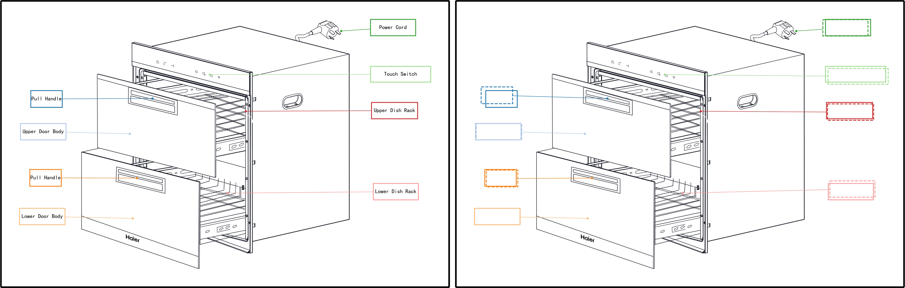
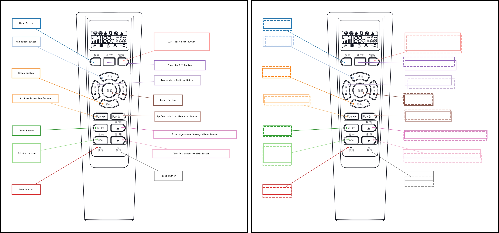

# Graph Transformer for Label Placement

Air Conditioner | Dishwasher | Remote    
:--:|:--:|:--:
 |  | 

This repository is the implementation of the paper: 

Jingwei Qu, Pingshun Zhang, Enyu Che, Yinan Chen, and Haibin Ling. [Graph Transformer for Label Placement](https://jingweiqu.github.io/project/LPGT/index.html). *(TVCG)*

It contains the training and evaluation procedures in the paper.

## Requirements
* **[Python](https://www.python.org/)** (>= 3.10.12)
* **[PyTorch](https://pytorch.org/)** (>= 2.0.1)
* **[PyG](https://www.pyg.org/)** (>= 2.3.1)

## Dataset
Download the [SWU-AMIL](https://higa.teracloud.jp/share/11e10e2e41362303) dataset and extract it to the folder `data`.

## Evaluation
Run evaluation using the trained models provided in the folder `params`:
```bash
python test.py experiments/amil.json
```

## Training
Run training:
```bash
python train.py experiments/amil.json
```

## Citation
```text
@article{qu2024graph,
 title={Graph Transformer for Label Placement},
 author={Qu, Jingwei and Zhang, Pingshun and Che, Enyu and Chen, Yinan and Ling, Haibin},
 journal={IEEE Transactions on Visualization and Computer Graphics},
 year={2024}
}
```
